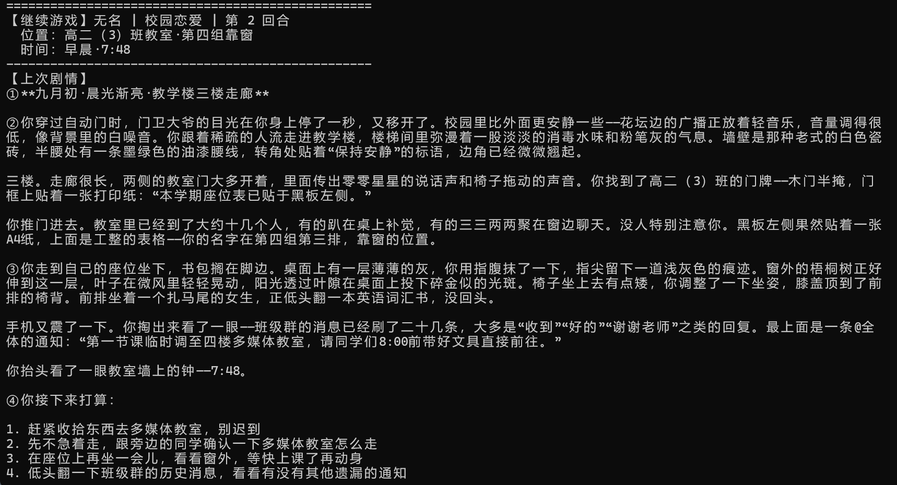

# 地球Online · Earth-Online

> 一个由 AI 驱动的**文字冒险游戏**。代码管理世界状态，AI 负责叙事——用"状态机 + 大模型"解决纯 AI 文字游戏的**失忆**问题。

<p align="center">
  
  
  
</p>

---

## 这是什么

市面上的 AI 文字游戏大多把一切都交给大模型，玩久了就会**失忆**（忘了你在哪、和谁什么关系）。地球Online 换了个思路：

> **代码是"世界的骨架"，AI 是"世界的皮肤"。**
> 代码维护确定性状态（位置、时间、物品、人物关系），AI 只负责把这些状态渲染成沉浸式的文字。

于是游戏既有大模型的自由叙事，又不会"聊着聊着就忘了"。

支持 **8 种世界观**：现代都市 / 古代历史 / 修仙玄幻 / 末日生存 / 娱乐圈养成 / 荒野求生 / 校园恋爱 / 悬疑推理。

## 核心特性

- **不会失忆**：位置、时间、物品、人物关系由代码硬约束管理，跨回合稳定延续
- **人物关系系统**：5 级关系（冷淡 → 认识 → 友好 → 信任 → 亲密）+ 内部进度值，自然成长
- **存档与读档**：任意时刻退出即自动存档，下次可"继续冒险"，回显上次剧情
- **自由输入 + 选项**：既可输入编号选择，也可自由描述你想做的任何事
- **强壮的 JSON 容错**：AI 输出格式异常时自动修复、重试、降级，不会因解析失败丢回合

## 截图



## 快速开始

### 方式一：下载 exe（推荐普通玩家）

1. 前往 [**Releases**](https://github.com/woodenman-cmd/earth-online/releases) 下载最新 `EarthOnline.exe`
2. 双击运行
3. 首次启动会提示输入 **DeepSeek API Key**（见下方"配置 API Key"）

### 方式二：从源码运行（开发者 / 想改代码）

```bash
git clone https://github.com/woodenman-cmd/earth-online.git
cd earth-online
pip install -r requirements.txt
python main.py
```

> Windows 用户也可以直接双击项目里的 `开始游戏.bat`。

## 配置 API Key

本游戏需要 **DeepSeek API Key**（大模型的"燃料"），需要你自己申请：

1. 打开 [DeepSeek 开放平台](https://platform.deepseek.com/api_keys) 注册
2. 创建一个 API Key（有免费额度，付费也很便宜）
3. **首次运行游戏时会提示你粘贴 Key，粘贴后会自动保存**，之后不用再输入

如果自动保存失败，也可以手动在项目根目录创建 `.env` 文件：

```
DEEPSEEK_API_KEY=你的密钥
DEEPSEEK_BASE_URL=https://api.deepseek.com/v1
```

> ⚠️ **`.env` 含有你的密钥，切勿分享或提交到 GitHub。**

## 玩法说明

启动后：

1. 选择**主菜单**：新的冒险 / 继续冒险 / 退出
2. 选择**世界模式**，创建角色（姓名、性别、外貌、家世、天赋、处世风格）
3. 进入剧情后，每个回合会给出**若干选项**：
   - 输入编号（如 `1`）选择预设选项
   - 或**自由输入**任何行动（如"我假装没看见，转身走向巷尾"）
4. 随时输入 `退出` 保存并离开，下次选"继续冒险"即可接续

## 项目架构

```
main.py                     CLI 入口（主菜单 / 存档选择 / 游戏循环）
src/
├── core/
│   ├── state.py            玩家状态 + 存档管理（StateManager）
│   └── world.py            世界配置加载
├── engine/
│   ├── client.py           DeepSeek API 封装
│   ├── context.py          拼装 Prompt（系统提示 + 状态 + 历史）
│   ├── parser.py           AI 输出的 JSON 解析（四层容错）
│   ├── updater.py          状态变更校验与翻译（硬约束层）
│   └── pipeline.py         单回合流程编排
└── utils/
    ├── logger.py           日志
    └── path.py             跨环境路径解析
config/world/               地点 / NPC / 事件配置
prompt.md                   系统提示词（叙事规则 + 输出协议）
storage/players/            玩家存档（运行时生成，不纳入版本控制）
```

**一次回合的数据流**：

```
玩家输入
  → 读取状态 (StateManager)
  → 组装 Prompt (ContextBuilder)
  → 调用 AI (AIClient)
  → 解析输出 (ResultParser)
  → 校验变更 (StateUpdater)
  → 写回状态 + 自动存档 (StateManager)
  → 返回叙事给玩家
```

## 常见问题

**Q：为什么需要我自己的 API Key？**
A：AI 叙事由 DeepSeek 提供，每个玩家的 Key 自己控制，作者不承担 API 费用。

**Q：exe 双击闪退？**
A：确认同目录下能正常联网，且已按要求输入 API Key。或改用源码方式运行查看报错。

**Q：玩到一半能退出吗？**
A：可以。每回合结束都会自动存档，下次"继续冒险"接着玩。

## 许可证

本项目基于 [MIT License](LICENSE) 开源。

## 反馈

欢迎提交 [Issue](https://github.com/woodenman-cmd/earth-online/issues) 反馈 bug 或建议。这是一个仍在完善的原型，任何反馈都是帮助。
